# netics-oprec-module2-2026

> Nama: Jalu Cahyo Senodiputro
>
> NRP: 5025241155

#### Instalasi Wazuh Manager pada VPS Ubuntu 24.04 Microsoft Azure
Untuk setup Wazuh Manager di VPS sebenarnya cukup gampang, langkah-langkahnya kurang lebih seperti ini:
1. Buat VM Ubuntu 24.04 dari Microsoft Azure dengan Minimal 2 CPU Cores & 4 GB RAM
2. Lalu kita harus membuat *rule port* yang akan digunakan Wazuh Manager (1514, 1515, (*opsional* 55000)) dengan cara pergi ke `Network Settings -> Create port rule` dari Dashboard VM
3. Lakukan Instalasi Wazuh Manager dengan mengikuti tutorial dari [Wazuh Manager Installation](https://documentation.wazuh.com/current/quickstart.html)
4. Terakhir kita bisa Login ke Web Dashboard Wazuh berdasarkan petunjuk dari instalasi diatas
    ```
    INFO: --- Summary ---
    INFO: You can access the web interface https://<WAZUH_DASHBOARD_IP_ADDRESS>
        User: admin
        Password: <ADMIN_PASSWORD>
    INFO: Installation finished.
    ```

#### Instalasi Wazuh Agent pada VM Local & VPS Microsoft Azure Ubuntu 24.04
Disini saya memilih untuk melakukan instalasi Wazuh Agent di 2 mesin berbeda, 1 di VPS yang sebelumnya dibuat untuk pengerjaan modul 1 dan 1 nya saya buat di VM Local.

Untuk proses instalasinya cukup gampang juga, langkah-langkahnya yaitu seperti ini:
1. Persiapkan mesin atau host yang akan kita instalasi Wazuh Agentnya
2. Ikuti tutorial instalasi dari [Wazuh Agent Installation](https://documentation.wazuh.com/current/installation-guide/wazuh-agent/wazuh-agent-package-linux.html). Pada step **Deploy a Wazuh agent** sesuaikan `WAZUH_MANAGER` dengan IP Address Wazuh Manager atau bisa juga mengikuti tutorial ini [Wazuh Agent Configuration](https://documentation.wazuh.com/current/user-manual/agent/agent-enrollment/enrollment-methods/via-agent-configuration/linux-endpoint.html)

#### Pastikan agent berhasil terhubung ke manager dengan mengecek apakah default events/logs dari agent sudah masuk dan terlihat di dashboard Wazuh.
Jika Wazuh Agent berhasil terinstal dan berjalan maka kita bisa kembali ke web dashboard Wazuh Manager untuk mengecek apakah Agent tersebut sudah berhasil terhubung ke Manager
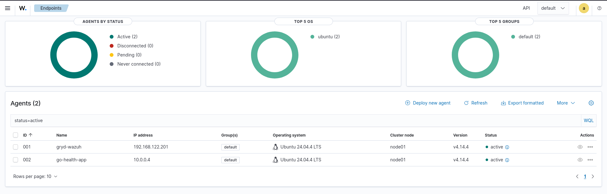
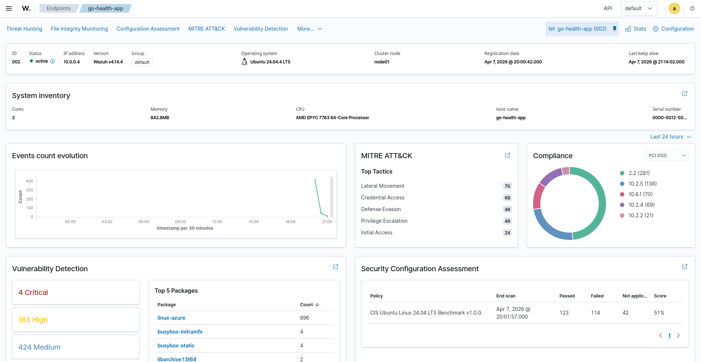
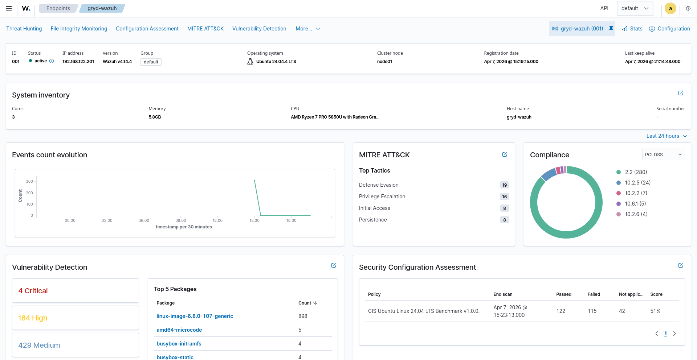


#### Buat/mencari dan implementasikan minimal 5 custom rules/custom alert pada agent kalian.

- Rule 1:
```xml
<rule id="110001" level="7">
        <if_group>syscheck</if_group>
        <match>/var/ossec/etc/ossec.conf</match>
        <description>/var/ossec/etc/ossec.conf has been edited</description>
        <mitre>
                <id>T1078</id>
        </mitre>
</rule>
```
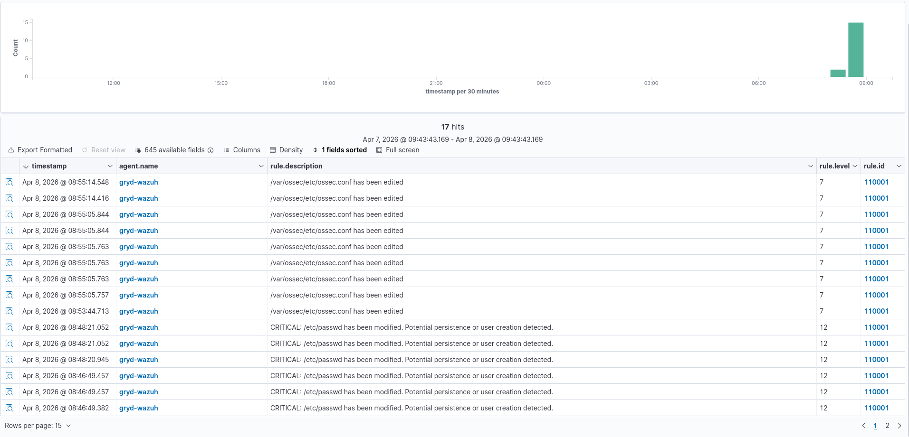

- Rule 2:
```xml
<rule id="110002" level="5">
        <if_sid>5715</if_sid>
        <if_group>syslog</if_group>
        <match>azureuser</match>
        <description>Successful SSH login as azureuser.</description>
        <mitre><id>T1021</id></mitre>
</rule>
```
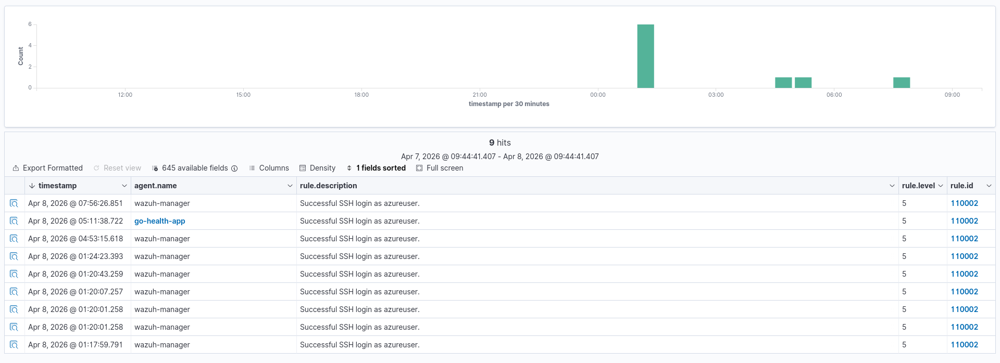

- Rule 3:
```xml
<rule id="110003" level="10">
        <if_group>syslog</if_group>
        <match>sudo:</match>
        <description>Privilege escalation activity: sudo command executed (check user and command).</description>
        <mitre><id>T1548</id></mitre>
</rule>
```
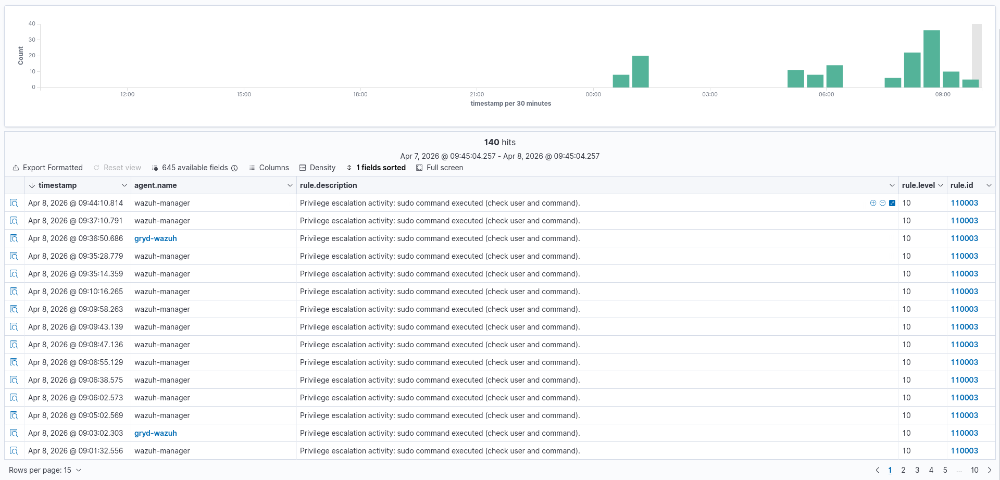

- Rule 4:
```xml
<rule id="110004" level="9">
        <if_group>syslog</if_group>
        <match>session opened for user root</match>
        <description>Privilege escalation activity: session opened for user root (possible su/sudo).</description>
        <mitre><id>T1548</id></mitre>
</rule>
```
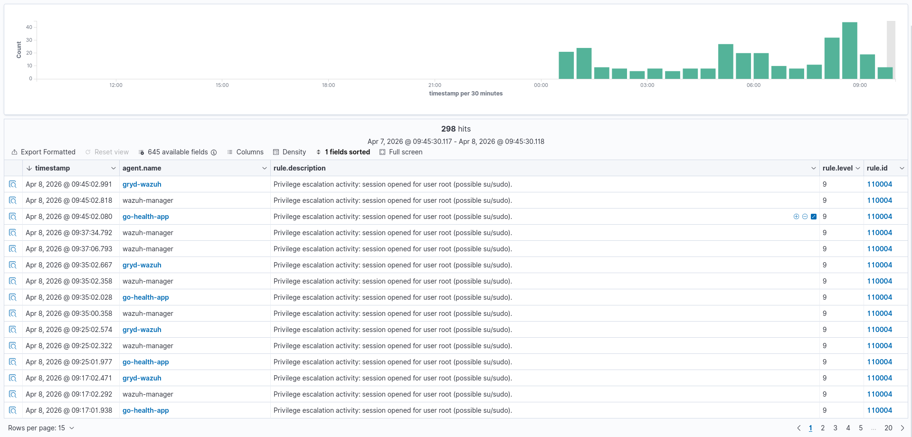

- Rule 5:
```xml
<rule id="110005" level="6">
        <if_sid>2504, 5762</if_sid>
        <if_group>syslog</if_group>
        <match>ROOT|root</match>
        <description>SSH failed attempt using root account.</description>
        <mitre><id>T1110</id></mitre>
</rule>
```
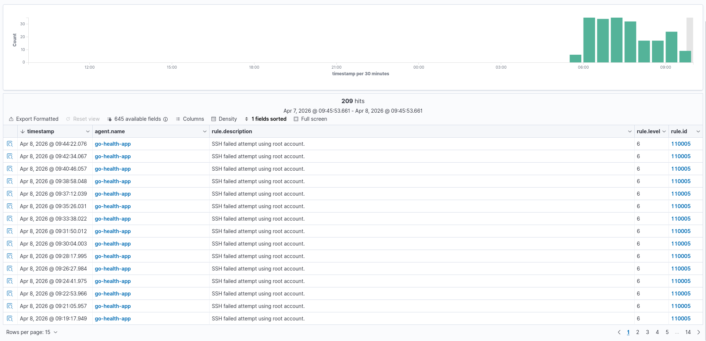

- Rule 6:
```xml
<rule id="110006" level="15">
        <if_sid>5715</if_sid>
        <if_group>syslog</if_group>
        <match>root</match>
        <description>SSH accepted login as root (should be disabled).</description>
        <mitre><id>T1110</id></mitre>
</rule>
```
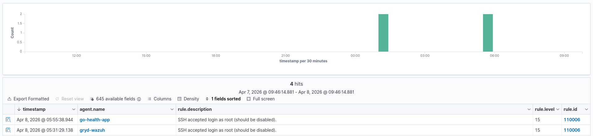

- Rule 7:
```xml
<rule id="110007" level="10" frequency="5" timeframe="60">
        <if_matched_sid>5710</if_matched_sid>
        <description>ALERT: High frequency SSH brute force attack detected from the same Source IP.</description>
        <mitre>
                <id>T1110.001</id>
        </mitre>
</rule>
```
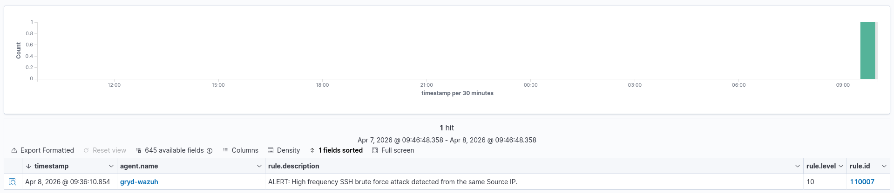

- Rule 8:
```xml
<rule id="110008" level="8">
        <if_sid>5404</if_sid>
        <description>WARNING: Multiple failed sudo execution attempts detected. Potential privilege escalation probing.</description>
        <mitre>
                <id>T1548.003</id>
        </mitre>
</rule>
```
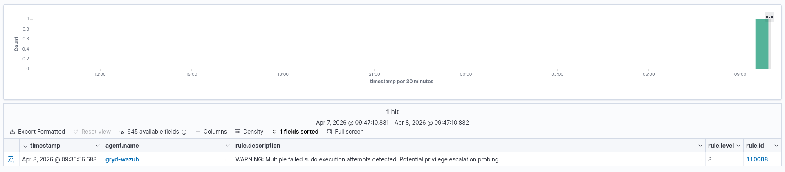

### Referensi:
- [Wazuh Ruleset Repo](https://github.com/wazuh/wazuh/tree/master/ruleset)
- [Wazuh Docs](https://documentation.wazuh.com)
- [Custom detection engineering & rule tuning (XML rules)](https://github.com/alejandroZ345/-Cloud-Native-Security-Operations-Wazuh-SIEM-XDR-Deployment/blob/main/phase-5-custom-rules.md)
- [Wazuh Custom Rule Creation](https://www.sbarjatiya.com/notes_wiki/index.php/Wazuh_Custom_Rule_Creation)
- [Wazuh Advanced Rules & Threat Hunting with Wazuh ](https://blog.cyberhawkconsultancy.org/2025/08/wazuh-advanced-rules-threat-hunting.html)
- [Writing Custom Wazuh Rules](https://pop-ecx.github.io/writing-custom-wazuh-rules/)
- [Github Copilot](./assets/wed_apr_08_2026_wazuh_agent_connectivity_issues_on_azure.json)